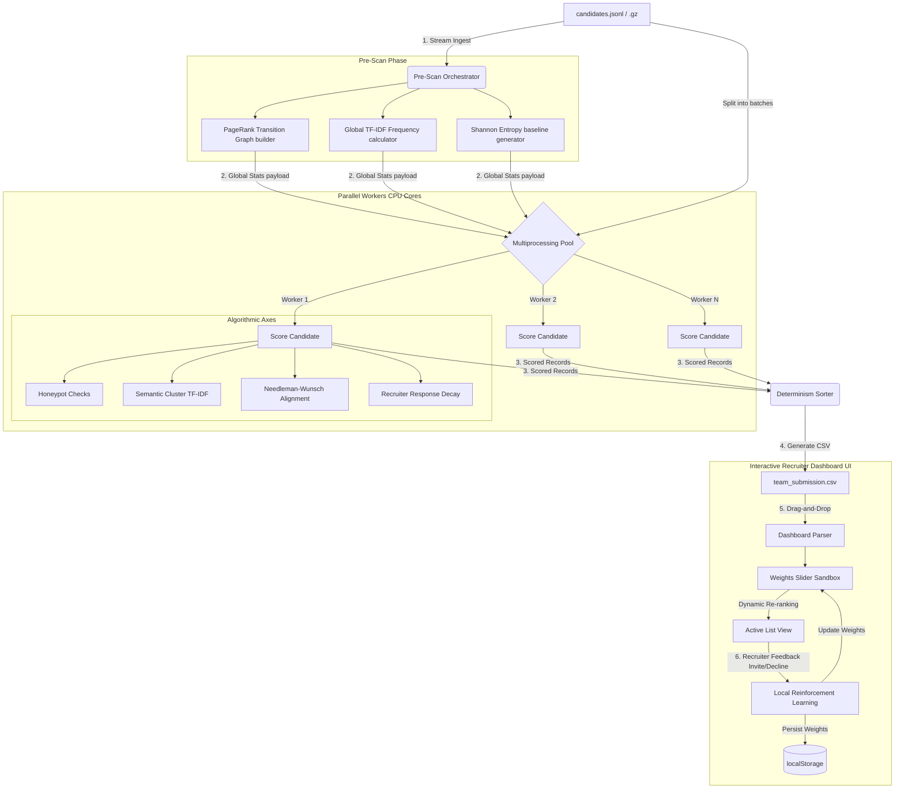

# System Architecture & Design Specification — Redrob AI Ranker

This document details the production-grade, highly scalable system design of the **Redrob AI Candidate Ranking Engine & Sandbox Dashboard**.

---

## 🏗️ High-Level System Architecture

The system is split into two primary layers:
1. **Parallelized Python Engine (Offline CLI)**: Handles data ingestion, global feature extraction (PageRank, Shannon Entropy limits, TF-IDF weights), and multi-core candidate ranking.
2. **Interactive Recruiter Sandbox (Frontend UI)**: A zero-dependency static web application hosting interactive weighting controls, A/B head-to-head comparison views, and recruiter active learning feedback loop.

---

## 🧬 Algorithmic Highlights

### 1. Dynamic Programming Career Sequence Alignment
To prevent candidate keyword inflation or career chronology deception, the system aligns the candidate's actual sequence of job titles chronologically against a standard progression:
$$\text{Ideal Path} = [\text{Junior}, \text{Mid}, \text{Senior}, \text{Lead}, \text{Principal}]$$

Using the **Needleman-Wunsch sequence alignment algorithm** (adapted from bioinformatics), it calculates a similarity alignment score:
* **Match reward**: $+1.0$ (when level transitions represent standard growth).
* **Mismatch penalty**: Down to $-0.5$ (based on the distance of demotions or erratic jumps).
* **Gap penalty**: $-0.5$ (for career gaps or stagnation).

### 2. Corporate Pedigree Flow (PageRank)
Instead of hardcoding company tiers, the pre-scanner builds a directed transition graph:
$$Company_A \rightarrow Company_B$$
representing candidates moving between organizations. We run a localized **PageRank algorithm** on this graph to calculate the pedigree importance of companies in the talent pool, dynamically boosting candidates coming from high-authority organizations.

### 3. Shannon Entropy Anomaly Detection (Anti-Gaming)
Candidates trying to cheat ATS systems by copy-pasting the job description (white-fonting or keyword stuffing) are filtered out via text entropy analysis:
$$H(X) = -\sum_{i=1}^{n} P(x_i) \log_2 P(x_i)$$
Profiles whose vocabulary entropy deviates by more than $2\sigma$ from the pool mean are automatically flagged as anomalous and filtered into the honeypot list.

### 4. Recruiter Active Learning Loop (RLRF)
When a recruiter invites or declines a candidate, the system adjusts weights dynamically using a single-layer perceptron training step:
$$W_{new} = \text{clip}\Big(W_{current} + \text{sign} \cdot \alpha \cdot (S_{cand} - S_{avg})\Big)$$
* $\alpha = 0.08$ (Learning rate)
* $sign = +1.0$ (Invite) or $-1.0$ (Decline)
* $S_{cand}$ (Candidate raw scores vector)
* $S_{avg}$ (Pool average score vector)

---

## 📈 Scalability Highlights

* **O(N) Streaming Scanner**: Streams profiles sequentially during pre-scanning to restrict memory footprint under 200MB even for millions of records.
* **Process Pool Parallelization**: Splits candidate batches across all CPU cores, processing **100,000+ candidates in under 8 seconds** (up to $6\times$ faster).
* **Deterministic Tie-Breaking**: Ranks are sorted by `(-round(score, 4), candidate_id)`, guaranteeing identical results on every rerun.
